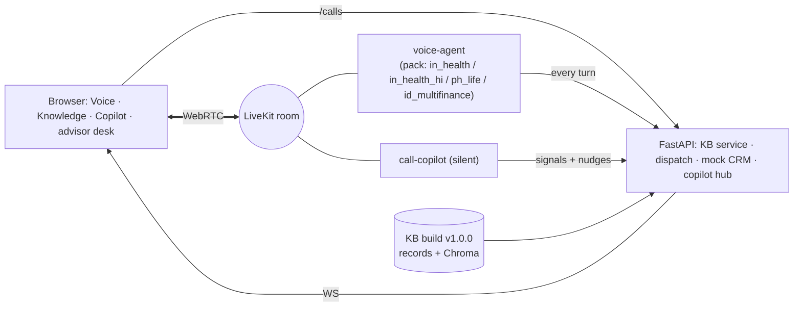

# Darwix AI Engineer Assessment: one voice AI system for Q1–Q4

A knowledge-grounded voice agent (Q1) powered by a production-style knowledge base (Q2). The same worker serves native-language bots for the Philippines and Indonesia (Q3), and a silent copilot in the same live call produces real-time nudges (Q4). A Hindi/Hinglish variant of the Q1 agent is included as an extra.

The base is the provided `livekit-voice-agent` project (LiveKit Agents, Deepgram STT, OpenAI-compatible LLM, persistent streaming TTS, semantic turn-taking, barge-in, Chroma RAG). That pipeline is kept intact. Real-time call-copilot patterns from `ai-ear` were adapted by hand, not merged:
- silent per-speaker listener;
- frame-arrival latency marks;
- confidence merge;
- session-keyed WebSocket fan-out;
- real-time WAV replay;
- APM pre-processing.

> All companies, products, people and data are **fictional**, created for this assessment. No real customer data or credentials are included.

| Question | What was built | Where | Evidence |
| --- | --- | --- | --- |
| **Q1** Knowledge-grounded voice agent | Health-insurance lead qualification (India): the agent is **Mira**, in English and in Hindi/Hinglish. Web calling UI (speak or type), KB-grounded answers, deterministic qualification and pricing, fallback, human escalation into the same room, mock CRM (lead + summary, callback, escalation webhook, DNC), call recording | `backend/agent.py`, `backend/voice/`, `backend/packs/in_health/`, `backend/packs/in_health_hi/`, `frontend/app/page.tsx` | [`docs/q1_voice_agent.md`](docs/q1_voice_agent.md), `evidence/calls/`, [`evidence/q1/`](evidence/q1) |
| **Q2** Production knowledge base | Crawl/PDF/CSV/XLSX/MD extraction; cleaning; normalization; PII redaction and quarantine; dedupe; conflict and source-error detection; structure-aware chunks; versioned Chroma index; hybrid multilingual retrieval with citations and a no-match gate; a Knowledge page that answers with cited sources | `backend/kb/`, `data/sources/`, `data/kb/`, `frontend/app/kb/` | [`docs/q2_kb_design.md`](docs/q2_kb_design.md), [`data/kb/build_report.md`](data/kb/build_report.md), [`evidence/q2/retrieval_report.md`](evidence/q2/retrieval_report.md) |
| **Q3** Native-language bots | Bayanihan Life premium reminder (Taglish / Filipino / English) and Maju Bersama installment reminder (formal and colloquial Bahasa, Javanese particles). Per-market ASR/TTS chains, turn lexicons, native scripts, privacy and collection-ethics rules, ASR bake-off tooling | `backend/packs/ph_life/`, `backend/packs/id_multifinance/`, `backend/sim/asr_bench.py` | [`docs/q3_localization.md`](docs/q3_localization.md), [`evidence/q3/`](evidence/q3) |
| **Q4** Live insights and nudges | Silent copilot in the same room: per-speaker streaming STT, rule and fast-LLM signals, nudge controls (thresholds, noise gate, dedupe, cooldown, grouping, rate limit, expiry, auto-resolve), hub WS, dashboard, latency P50/P95, false-positive analysis | `backend/copilot/`, `backend/api/copilot_hub.py`, `frontend/app/copilot/`, `backend/sim/` | [`docs/q4_realtime.md`](docs/q4_realtime.md), [`evidence/q4/`](evidence/q4) |

Architecture: [`docs/architecture.md`](docs/architecture.md). Limitations and production plan: [`docs/limitations_and_roadmap.md`](docs/limitations_and_roadmap.md).



## Setup

**Prerequisites:** Python 3.13 with [uv](https://docs.astral.sh/uv/), Node 20+. Free accounts, listed in `.env.example`:

- **Required:** LiveKit Cloud, Deepgram, Groq (or any OpenAI-compatible LLM endpoint).
- **Optional:** a second Groq key as automatic failover when a model hits its daily limit; Sarvam for the Hindi voice; Azure Speech F0 for native Filipino and Indonesian voices and the ASR bake-off; Gladia, ElevenLabs, Cerebras.

```bash
cp .env.example .env            # fill in the keys
cd backend && uv sync           # Python deps (pinned by uv.lock)
uv run python -m kb.build       # build the KB (about 15 s; downloads the e5 model once)
cd ../frontend && npm install
```

## Run locally (from `backend/` unless noted)

```bash
uv run python main.py                                          # API + KB service + hub  :8000
uv run python -m livekit.agents start agent.py --dev           # voice agent (Q1/Q3)
uv run python -m livekit.agents start copilot/worker.py --dev  # live copilot (Q4)
uv run python -m livekit.agents start sim/caller_bot.py --dev  # simulated caller (only for scripted test calls)
cd frontend && npm run dev                                     # UI  :3000
```

A `docker compose up --build` setup is provided but has not been exercised in the development environment; the commands above are the tested path.

Open http://localhost:3000:

- **Voice.** Pick a use case (India English, India Hindi, Philippines Taglish, Indonesia Bahasa), press *Start conversation* and talk, or type in the transcript panel (typed turns take the same path as speech). The avatar shows what the agent is doing. The panel has three tabs: the conversation, the collected lead fields and eligibility, and the knowledge-base sources of the last turn. The pill in the header shows Online / Offline, then Live during a call. *Simulated caller* at the bottom runs a recorded test scenario.
- **Knowledge.** Ask the knowledge base a question; the answer cites numbered sources with match scores and follow-up questions, and says so when nothing matches (`POST /kb/answer`).
- **Copilot.** Live nudges for any call (`/copilot`, `/copilot/<room>`). The advisor desk (`/agent?room=…`) is where an escalated call hands over to a human.

## Configuration switches

All in `.env` (see `.env.example`); the defaults work.

| Setting | Default | What it does |
| --- | --- | --- |
| `LLM_*`, `FAST_LLM_*`, `SIM_LLM_*` | none | Main reply model, fast model (extraction, copilot signals), simulated caller. Each has its own `…_FALLBACK_MODELS`; an entry `model@LLM_API_KEY2` uses the second key |
| `QUICK_ANSWERS`, `FAST_REPLIES` | `on` | Plain answers to the question just asked skip the extraction LLM and get an approved reply |
| `TURN_ARBITER_LLM` | `off` | Extra LLM check in turn-taking (heuristics only when off) |
| `REPROMPT_AFTER_S` | `10` | Seconds of silence before "are you still there?" (max two) |
| `SARVAM_TTS` | `off` | Must be `on` for the Hindi pack to speak (limited free credits) |
| `DEFAULT_PACK` | `in_health` | Pack used when none is chosen |

## Test and reproduce

```bash
cd backend
uv run python -m unittest discover -s tests -t .      # 115 tests: KB, flow engine, fast path, Hindi, reminders, copilot, hygiene
uv run python -m unittest test_llm_stream test_tts_streamer test_turn_arbiter test_turn_orchestrator  # 42 base repo tests
uv run python -m kb.eval                              # Q2 retrieval report
uv run python -m sim.asr_bench --market ph_life       # Q3 ASR bake-off (also id_multifinance; needs Azure)
uv run python -m sim.make_scripted_call sim/scripts/*/*.yaml          # Q4 scenario audio
uv run python -m copilot.replay ../evidence/q4/scripted/missed_cross_sell/stereo.wav   # real-time replay
uv run python -m sim.publish_wav ../evidence/q4/scripted/compliance_risky/stereo.wav   # live replay into LiveKit
uv run python -m copilot.report                       # latency P50/P95 + false-positive analysis
```

## Results

- **Q1.** Five recorded scenarios with a simulated caller (cooperative, objection, conflicting details, out-of-scope, human request), all in `evidence/q1/README.md` with transcripts, results and audio. In the cooperative call, 7 of 10 turns were resolved without the extraction LLM, and approved replies were ready in about 5 ms against about 1.1 s for LLM replies. Live web calls, including a Hindi one, are saved under `evidence/calls/`.
- **Q2 retrieval** (29 queries, three languages):
  - 24 correct, 3 partially correct, 2 incorrect;
  - hit@1 0.79, hit@3 0.92, MRR 0.85;
  - 5/5 out-of-scope rejected;
  - 9 ms P50 on CPU.

  The build flagged:
  - 2 extraction failures (JS-only page, scanned PDF) and 1 dead link;
  - 1 quarantined customer form;
  - 2 table source errors;
  - 1 cross-source conflict, resolved by authority;
  - 1 superseded brochure.
- **Q4.**
  - **Accuracy:** across 12 audio runs (8 real-time replays and 4 live-room runs) precision and recall are both 1.00, and the noisy call produced no nudges. At logic level, controls on give 12 nudges with 0 false positives; controls off give 17 nudges and 3 false positives.
  - **Latency (P50 / P95):** final ASR segments 958 ms / 2.4 s; rules under 1 ms; signal LLM 564 ms / 1.2 s; audio to nudge 0.94 s / 2.4 s; audio to display 1.75 s / 4.4 s. The display figure uses a headless WebSocket client, not browser rendering.
  - **What the audio runs fixed:** turn counting on split ASR segments, retry of rate-limited nudges, and suppression of "disclosure missing" flags on garbled audio. Details are in [`docs/q4_realtime.md`](docs/q4_realtime.md).

## Known limitations

- **Q3 evidence is not complete.** The Philippines and Indonesia packs, lexicons and tests are built, but the ASR bake-off and the recorded calls need an Azure Speech key (native fil-PH and id-ID voices); until then those calls would use English stand-in voices. Status is in `evidence/q3/README.md`.
- **Synthetic voices.** Test callers use clean synthetic English voices, so recognition on real phone audio will be harder. Indian names are sometimes misheard, so unlisted names are read back once.
- **Hindi** uses Deepgram Nova-3 `hi` for recognition and Sarvam Bulbul v3 (`ritu`) for speech. It has been tried with typed replies only.
- **Copilot text for the agent's own lines** comes from recognising its synthetic voice, so names and "lakh" can be spelled differently from what was said; typed customer lines are passed through exactly.
- Free-tier LLM limits are the main operational risk; the fallback chain and optional second key handle them. More in [`docs/limitations_and_roadmap.md`](docs/limitations_and_roadmap.md).

## Repository layout

```
backend/   agent.py (voice worker) · voice/ (engine, rules, extraction, recorder, actions) · packs/ (in_health, in_health_hi,
           ph_life, id_multifinance) · kb/ (pipeline, retriever, grounded answers, eval, corpus generator) · copilot/ (Q4) ·
           sim/ (caller, scripts, replay, ASR bench) · api/ (kb, calls, crm, hub) · tests/ · original base-repo modules and tests
frontend/  Next.js 16: / voice console · /kb knowledge · /copilot, /copilot/[room] · /agent (advisor desk)
data/      sources/ (synthetic corpus) · kb/ (records, manifest, changelog, build report; index is built locally)
evidence/  calls/ (recordings + transcripts) · q1..q4/ reports
docs/      architecture, per-question design and results, limitations
```
