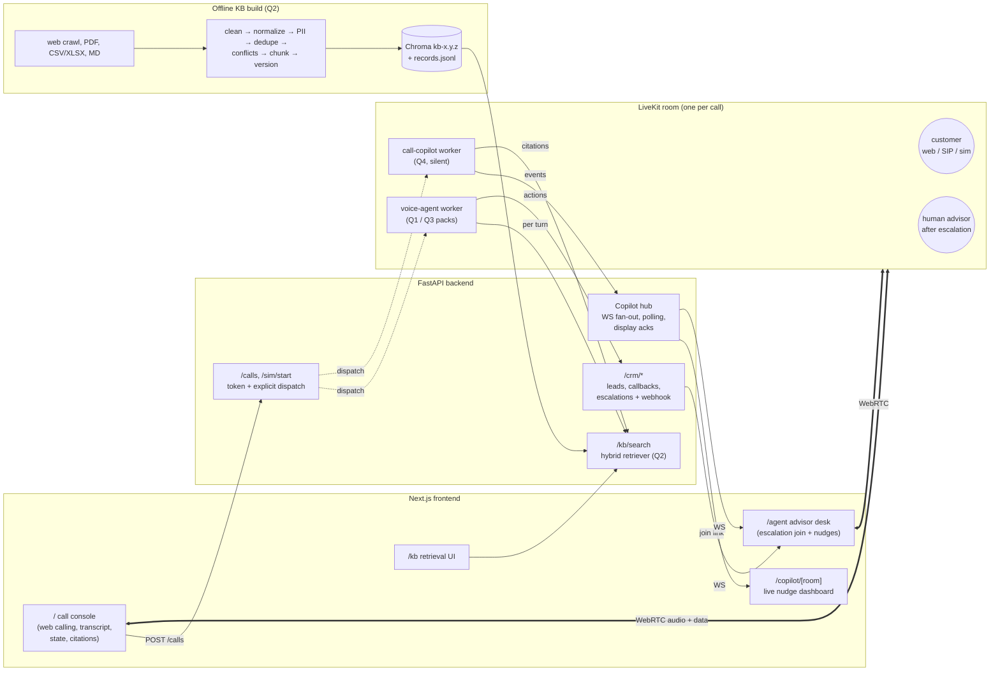
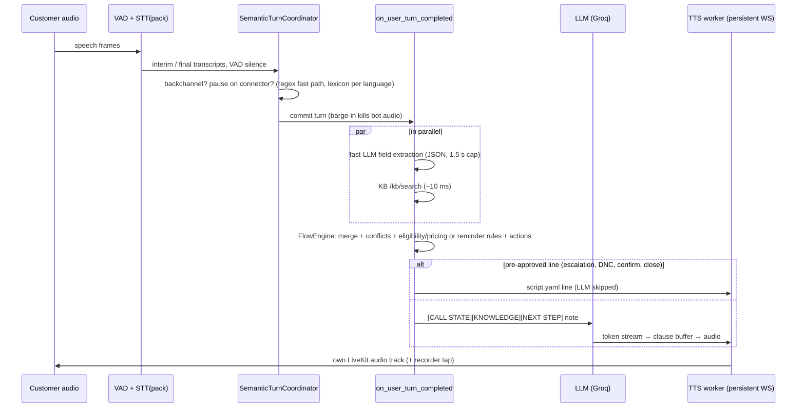

# Architecture

The four questions are built as one system. Q2 records feed Q1 answers, the Q3 market bots and Q4 nudge content. Q3 reuses the Q1 voice worker through configuration packs. Q4 listens to the same live LiveKit room as the call.

## Voice agent turn (Q1/Q3)

## Components

| Component | File(s) | Role |
|---|---|---|
| Voice worker | `backend/agent.py` | Base repo pipeline (manual turns, barge-in, idle watchdog, persistent TTS) plus the per-call controller, recorder and data-channel state |
| Packs | `backend/packs/<id>/` | Persona prompt, script lines, field schema and rules, compliance, STT/TTS chain, turn lexicon, copilot signals |
| Flow engine | `backend/voice/engine.py`, `rules.py`, `state.py`, `extract.py` | Deterministic qualification and reminder logic. The LLM only phrases replies. |
| KB | `backend/kb/` | Offline build pipeline, hybrid retriever, eval harness |
| Copilot | `backend/copilot/` | Per-speaker streaming STT, rule and LLM signals, nudge controls, hub client, replay, report |
| Simulation | `backend/sim/` | LLM persona caller, scripted two-track calls, real-time WAV publisher, ASR bench |
| API | `backend/main.py`, `backend/api/` | KB service, calls/dispatch, mock CRM, copilot hub |
| Frontend | `frontend/app/` | Voice console, knowledge page, copilot rooms and dashboard, advisor desk |

## Latency budget (voice turn)

| Stage | Target | Notes |
|---|---|---|
| VAD silence | 400 ms | Silero `min_silence_duration`; 1,200 ms when the speaker pauses on a connector |
| Extraction ∥ retrieval | ≤ 600 ms (extract), ~10 ms (KB) | Run in parallel, hard 1.5 s cap; on timeout the turn proceeds |
| LLM TTFT | 150–350 ms | Groq Llama 3.3 70B |
| TTS first audio | 100–300 ms | Azure (per clause) / Deepgram Aura (WebSocket) |

Measured per-turn values are logged in each call's `result.json` (`events` → `trace` / `llm_metrics`).
