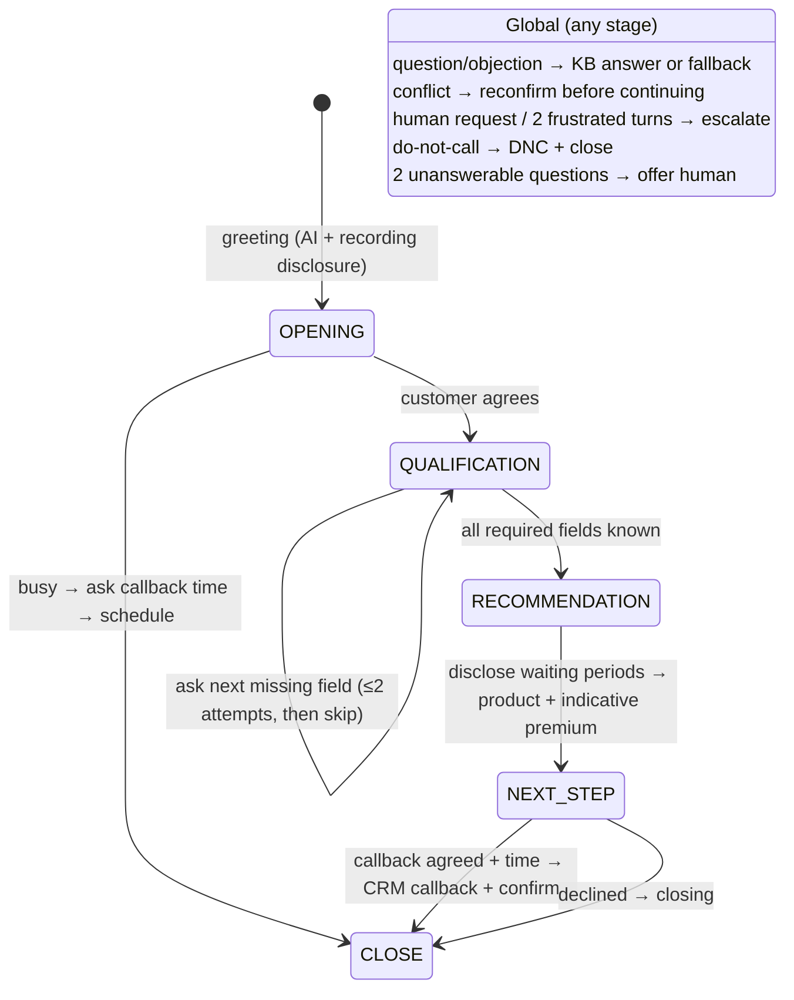

# Q1: Knowledge-grounded voice agent (health-insurance lead qualification, India)

**Use case:** Prithvi Health (fictional) calls inbound web leads. The agent qualifies the lead, answers questions from the KB, handles objections, gives an indicative premium, and books an advisor callback or escalates to a human.

**Interface:** web calling at `/`, using LiveKit WebRTC. A phone number can be attached to the same agent via LiveKit SIP; see `README.md`.

## Configuration (pack `backend/packs/in_health/`)

| File | Contents |
|---|---|
| `prompt.md` | Short persona and behaviour rules. **No FAQs, objections or policy facts.** |
| `script.yaml` | Pre-approved lines: greeting with AI and recording disclosure, fallback, out-of-scope, escalation, DNC, callback confirmation, closing, reconfirmation |
| `rules.yaml` | Business rules: ordered field schema with validation, product age ranges, city zones and premium factors, sum-insured guidance, budget tolerance, medical-test and co-payment rules, the disclosure required before quoting, escalation thresholds |
| `compliance.yaml` | Required disclosures and risky-statement patterns (also used by the Q4 copilot) |
| `pack.yaml` | STT (Deepgram Nova-3 en-IN with keyterms); TTS chain: Azure en-IN Neerja, then Deepgram Aura-2, then Sarvam |

The agent reaches FAQs, objections and policy facts only through the KB (Q2), retrieved every turn.

## Conversation flow

**Qualification logic** (`voice/rules.py`, deterministic):
- **Product:**
  - Prithvi Secure: single adult, 18–65;
  - Prithvi FamilyShield: spouse and/or children;
  - Prithvi Silver: over 65, or parents aged 60–75.
- **Not eligible:** above 75, more than 3 children, or active serious treatment (refer to the underwriter and offer a human).
- **Zone:** from the city (A/B/C), giving a factor of 1.0, 0.9 or 0.8 and a minimum recommended sum insured.
- **Premium:** looked up in the same rate table the KB indexes. Rows flagged as source errors are never quoted ("an advisor will share the exact premium").
- **Grade:**
  - hot: premium within budget +15% and buying now;
  - warm: budget gap, or the budget question was skipped;
  - cold: later / not interested;
  - not_eligible.
- **Medical tests:** when age ≥ 46, sum insured ≥ ₹25 lakh, or a pre-existing condition. Co-payment is 20% on Silver and 10% on Secure at entry age 61 or above.

**Unsure about the budget:** when a customer cannot name a yearly budget, the agent offers the plan sizes their city and profile allow, with indicative premiums from the rate table, and asks which to try ("the first is a five lakh cover at about five thousand eight hundred rupees a year; the second..."). The offer is a fixed line built from the rules engine, so no price is ever written by the LLM. A pick by position, cover size, price or "the cheapest" sets the preferred cover and the budget in one step. If it is still unclear the budget is skipped and the lead grades warm. A question asked in the same turn is answered first and the options follow on the next turn.

**Budget too low:** when the budget is more than 15% below the cheapest plan that fits, the agent says so, names that plan and its premium, and asks whether they want it. Yes sets the cover and budget to that plan; no keeps their figure and the lead grades warm with a budget-gap note. Both budget offers speak the waiting-period disclosure before any price.

**Short-answer fast path** (`voice/quick.py`): the engine records which field it just asked.
- **Strict resolution.** A plain answer to that field is resolved without the extraction LLM. This covers yes/no ("Nahi ji", "No, none of us have any"), numbers ("I'm 34"), amounts ("1.5 lakh", "2000 a month" → ₹24,000), a known city, or a name. Anything else returns nothing and takes the LLM path below: hedges ("I think so"), contrasts ("no, but my father…"), extra facts, questions, unknown cities, and a "no" to an identity check.
- **LLM-worded questions are checked.** When the LLM phrased the question, the answer is mapped only if the question contains the field's cue words, so "yes" after "are you still there?" is never stored as a field.
- **Approved replies.** When such an answer leads straight to the next plain question, the agent speaks an approved acknowledgement plus that question from `script.yaml`, with variants rotated by turn. The main LLM is skipped.
- **Measured on a cooperative call:** 7 of 11 turns were resolved this way, and 6 got an approved reply. Those replies were ready in 5 ms, against about 1,070 ms for LLM replies. The LLM still writes recommendations, answers, objections and anything unclear.
- **Switches:** `QUICK_ANSWERS` and `FAST_REPLIES` (`on`/`off`).

**Grounded answers:** each other customer turn runs field extraction and KB retrieval in parallel. Questions and objections get a `[KNOWLEDGE]` block with record IDs and an instruction to answer only from it. `NO_RELEVANT_INFO` triggers the scripted fallback ("I don't have that information right now…") plus an advisor offer. After two misses in a row the agent offers a human.

**Incomplete or conflicting details:**
- A changed value (age 34 → 43) is held as a conflict, and the agent asks which is correct before continuing.
- Implausible values (age 140) are rejected.
- A question unanswered twice is skipped, and eligibility is computed without it (grade becomes warm).

**Human escalation:** triggered by the customer's request, two frustrated turns, an underwriter referral, or repeated unanswerable questions. It does three things:
- creates a CRM escalation with the full summary;
- calls the optional `ESCALATION_WEBHOOK_URL`;
- publishes an advisor join link for the same room.

The bot falls silent when the advisor joins, and the Q4 copilot keeps nudging the advisor. If nobody joins within 90 s, a priority callback is booked.

**Business action (mock CRM):** every call writes a lead with grade, product, premium, fields, conflicts, objections and outcome (`/crm/leads`). It also writes callbacks (`/crm/callbacks`), escalations (`/crm/escalations` plus webhook) and DNC entries.

## Test calls

The required coverage is generated by the persona caller (`sim/caller_bot.py`). It talks to the agent over real STT/TTS in the same room. Run them from the console ("Simulated test call"), or with `POST /sim/start {"pack":"in_health","scenario":...}`.

| Scenario | Persona file | What it exercises |
|---|---|---|
| Cooperative | `cooperative.yaml` | Full qualification; family floater; mid-call maternity question (KB); callback accepted |
| Objection | `objection.yaml` | Employer cover, too expensive, "claims get rejected" (KB playbook); callback declined |
| Incomplete/conflicting | `conflicting.yaml` | Age 34 → 43 conflict and reconfirmation; unknown budget skipped; thyroid flagged as pre-existing |
| Out-of-scope | `out_of_scope.yaml` | Car insurance, mutual funds, overseas treatment: fallback, no invention |
| Human request | `human_request.yaml` | Parents 74/78 (Silver vs over-75), then "connect me to an agent": escalation with join link |

Each call writes `evidence/calls/<timestamp>_in_health_<scenario>_<id>/`:
- `transcript.md` and `transcript.json`, with timestamps and KB citations per agent turn;
- `result.json`, with outcome, grade, fields, eligibility, events and per-turn latency traces;
- `customer.flac`, `agent.flac`, `mixed.flac` and `stereo.flac`.

**Results:** see `evidence/q1/README.md`. It is generated after the live runs; the status there is honest about what has and hasn't been run.

## Unit-tested behaviour

`tests/test_engine.py` covers:
- cooperative flow to recommendation, with the disclosure stated before the quote;
- question order;
- conflict, then confirmation, then correction;
- skipping after repeated non-answers;
- escalation, DNC, and knowledge vs fallback;
- repeated misses offering a human;
- invalid values;
- family-floater zone pricing, flagged rates never quoted, the senior move to Silver with co-payment, and underwriter referral;
- spoken amounts.
